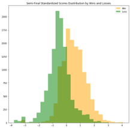
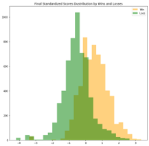
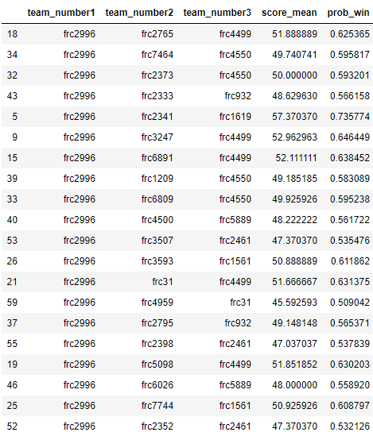

# FRC Scouting Recommender
# MSDS692 Data Science Practicum 1
# J. Patrick Bernard
## Description
The purpose of this project is to build a recommender and classifier that a FIRST Robotics team, FIRST Robotic Competition (FRC) could use to select the best possible alliance partners for the final rounds. A secondary goal will be to build a curriculum that can be used to teach the high students what Data Science is and how they can use it without having in-depth knowledge of the math and techniques.

During qualifying rounds teams are randomly grouped into two alliances of three teams each. At the end of qualifying, the top eight teams choose who their alliance partners will be. Match scores are recorded for each alliance.
## Hypothesis
My hypothesis is that by analyzing historical match scores a recommender can be developed. Match data can be divided into two parts. The qualifying round data will be used to develop the recommender and the team classifier. Verification data can be derived from the final round data. There will be challenges with the verification data. Since the alliances were not chosen with this system in place the alliances formed may not reflect what the recommender would have chosen. Alliances are made up of three teams, so the recommender could match two or three teams in the verification data. Allowances will have to be made when comparing the recommendations to the final rounds.
## Assumptions
Because scores that are reported for an alliance and not individual teams. As I assign the alliance scores to a specific team, I am assuming that better team will acquire higher scores over the course of a qualifying rounds.

I also assume that there will be other criteria collected at the regional in addition for making the final alliance selections by the team.
## Data Engineering and Exploration
### Data Source:
My data was downloaded from the website [The Blue Alliance  (TBA)](https://www.thebluealliance.com/)   this site collects information on all the FRC competition in the world.  The information is stores and disseminated via their app and other method for the teams and spectators to consume.  Data is for matches are reported by match and alliance. For my project I will have to transform that data to a team focus.
- Data used for years 2016 through 2019
- Data files retrieved
  - Events (72495 rows)
    - Turned into ~434,000 rows 
  - Awards (16380 row)
### Data Cleaning
For the event data, the csv file each row reported on the result of a match. 
For my analysis I need the data to be organized by Team.  For each row of data from TBA 6 rows of data had to be created and a win flag needed to be set so I could identify who won each match.  I also had to parse the year,regional,match column into separate year, regionals, round, and match columns. For clarity I gave each round a more descriptive identifier('Final', 'QtrF', 'Qual', 'SemiF’).
### Data Exploration
For a first look at the data I plotted the scores from each year color coding then by win or loose. The plot in Figure 3 illistrates the effect of there is a new game each year. The scoring changes each year and to be able to compare the data the scores will need to be standardized. Each of the years and rounds have been standardize so that the mean value is zero and the standard deviation is one.  When you look at FIGURE 4 the data for each year is comparable and we can treat it and one data set. I also looked at the mean  score with the Standard deviation.  I calculated the mean score for each year and I also separated it in to the round that was being played.  This is important to understand since as the matches go from qualifying to finals the mean score is different and the mean increase for each round.  For a team this is important to set expectations as team go into the final round and will be selecting partner teams. 
   
In Figures 6 through 9 we see the data distribution by round for all of the standardized data I have outline the mean value (0) with a read box so it was easier to identify on the figures.  For all of the chart there data has a normal distribution. This is important so that we can use analysis techniques that assume a normal (gaussian) distribution and not have to account for it.  Another thing I noticed is the barker green data.  This is actually the overlap of the wins and loose data.  This is an indication of score that could be achieved and either win or loose the match.  As the scores move from qualify through the final rounds you can notice that there is a change in shape. The over lap in qualifying is broad and tall indication that there are more possible ambiguous scores In the final round the overlap is narrower and it is also skewed to the right.  Even though the scores are higher it still does not guarantee a win.

### Are Awards important?
A common discussion with teams is:  Are the award important?  When looking at the scatterplot   I have graphed the number of matches won verse the number of awards won.  You can see that teams that have won more matches are those teams that have also won more awards.  Remember that this is only for the four-year period of data being analyzed. This may not be a feature for selecting a team to join your alliance. I do think it does indicate teams that have well established processes and are consistent performers.  I did include a table that has a random sample of record to further demonstrate the results.
## The Recommender
### Data Preparation
There is one more step of preparation that need to be performed so that a model can be developed.  The categorical data, regional names and the rounds columns need to be turned into numeric values for processing.  I used 'year','score_std','regional_numcode','g_rnd_numcode’ as feature in the logistical regression to determine the probability of win and probability of loss.  This also sets the weights and bias of the model so that new data can be run through the model to calculate the probability of win and loose for the regional data, the new data does not change the weights and biases.
### Recommender Creation  
To create the logic for the recommender I extracted the data for the 2019 Oklahoma City regional.  I also extracted only the qualifying rounds so to emulate the data the team would have available to them for decision making.  The first step what to get the data configured into the correct format and run it through our model to assign the probability of win and loss to each match.  In this figure we see a comparison of the probability to win and the match scores non-standardized).   You can visually determine what score will have a certain probability of win. For instance, if you are seeking a 60% probability of winning you will need a score of 50 or greater. 
The mean score for a team is the average score achieve in match play and error bars show the range of scores the team had.  This is important for final team selections. In my assumption I said that better team will aggregate a higher score.  But because the scores are actually the result of three teams working together it is important to look at this chart.  The error bars are an indicator of how the other alliance teams affected the scores. If the error bars are large, this indicates that the team was not necessarily the strongest team on the alliance and other team actually had more effect on the overall performance of the alliance. 
### Creating the Recommendation  
The recommendation is built with two loop passes.  The first pass, the subject team is paired with every other team and the mean and probability to win is calculated.  In the second pass this is a little more complicated. The pairing is compared to the other team in the regional. If the team would increase or at least keep the mean score the same that team is added to the alliance.  This is done for all of the teams and a list of selections is generated.  For each alliance a mean score and probability to win is calculated.    Figure 15 is a sample of the list that is generated.  Here you see that the three teams that are a suggested alliance and the mean score and probability to win for those teams.  With is information and what we know about matches, the final round score is always higher, we can start looking at the team that have a mean score that is closer to the max qualifying round scores.  Combine this with the scouting information that was collected at the regional event, and other information that the team feel makes for a good alliance partner, a final choice can be made.  
### Verification
There is not a great way to determine if the recommender is right.  So, I retrieved the actual alliances from the regional and use the data from the recommender to make the same recommendation score for the actual alliances.  The score column has the score the alliance achieves in the quarter final round and the record column contain the whether the team won or loosed the matches, a win equals a 1.  team with the higher probability of win fared better than the teams with lower probability of win scores.  From the mean scores chart we can determine there is a 23% lift in scores from the qualifying round to the quarter final round.  If we look at the standard deviation for each round, they are all consistent for the first three rounds so if we choose teams with scores that are higher, we can have more confidence in the recommendation when it is paired with its probability of winning.    To help verify and give another data point to the decision makers, I use a clustering algorithm to see how the team data grouped together. I used a neamShift version of a k-mean clustering.  I choose this because I did not need a number of clusters identified before I ran the algorithm, that was determined in the processing. Figure 16 is the clustering of the alliance recommended. If there was some conflict in getting an actual recommended alliance pairing because one of the preferred teams has been selected the color group could be used to select a substitute team. The color groups identify team with similar characteristics.  I also ran the meanshift against the team scores. The results of this did not really provided any meaningful information. 
### What's Next  
- Operationalize the Notebook code
    - Create a .py file or class that can be run from the command line or called from another piece of code.
    - Create a series of utilities that summarize data to assist with answering scouting questions
- Refine some of the processes to speed them up
    - Some of the processing took 8 to 12 hours to complete
- Refine this work package into a series of lessons that can be taught to the student members of the team
- Build processes to read data from a JSON stream for use during competition
- Build a team performance predictive model
    - Use historical score to predict future performance
    - Plot team scoring tends over time
- Build a regional pre-event scouting tool 
    - collect historical team metric, 
        - Metrics: mean scores, standard deviation, trending information
awards won.  
### Lessons Learned
- Save data after long processes have been completed
    - This make recovering data easier if the data structure gets corrupted and a restart is needed
- Data preparation is important and time consuming
    - This effect down line decisions and processes
- Be careful of how you name column
     - Don’t use reserved words as a name

## References
Here is a list of sites I referred to and provided a significate amount of assistance in the development of this project.  

https://stackoverflow.com/questions/3451111/unzipping-files-in-python
https://stackoverflow.com/questions/47379476/how-to-convert-bytes-data-into-a-python-pandas-dataframe
https://cmdlinetips.com/2020/05/fun-with-pandas-groupby-aggregate-multi-index-and-unstack/ 
https://machinelearningmastery.com/tpot-for-automated-machine-learning-in-python/
https://machinelearningmastery.com/make-predictions-scikit-learn/
http://sfb649.wiwi.hu-berlin.de/fedc_homepage/xplore/tutorials/xegbohtmlnode63.html
https://docs.scipy.org/doc/scipy/reference/tutorial/optimize.html
https://pythonprogramming.net/mean-shift-titanic-dataset-machine-learning-tutorial/

